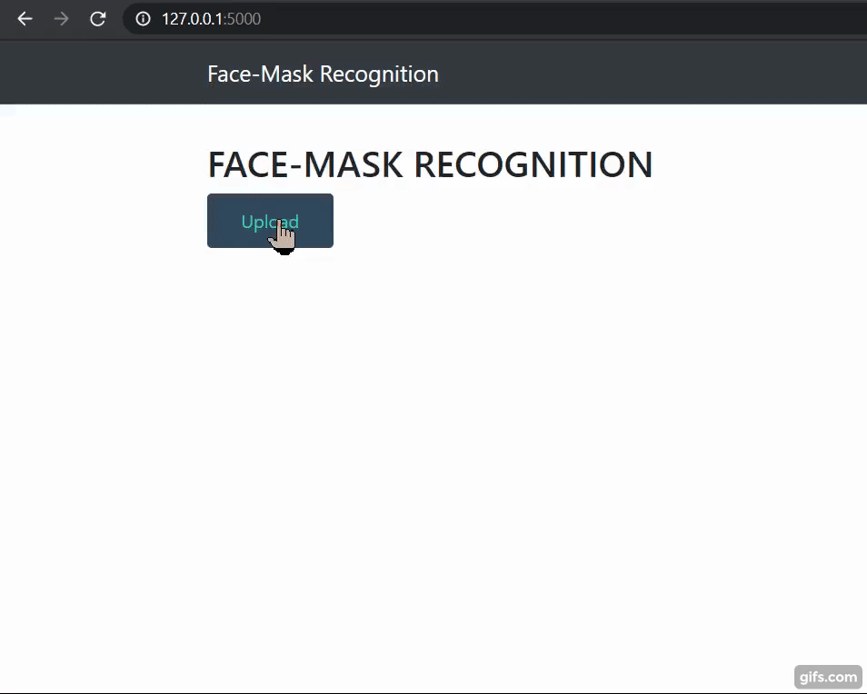

# Face-Mask-Detection-Flask-Web-App
I created a deep learning end to end flask web app to detect face mask in uploaded pics using my previous Face Mask Prediction model using MOBILENET
 
A deep learning model to detect face mask in images using MobileNET.
The GUI is built using HTML & CSS.  
The backend is built using Flask  
I used GPU accelerator for this model since teh GPU version of Tensorflow was required for MobileNet.
You can use your own GPU system or if you don't have a GPU you can either use GOOGLE COLAB or KAGGLE kernels which provide their own GPU kernels.  
 
Libraries used:  
Tensorflow  
Keras  
Numpy  
Pandas  
OpenCV  
Scipy  
Flask  
Requests  
 
Fine-tuning setup is a three-step process:  

1] Load MobileNet with pre-trained ImageNet weights, leaving off head of network (Lines 88 and 89)  
2] Construct a new FC head, and append it to the base in place of the old head (Lines 93-102)  
3] Freeze the base layers of the network (Lines 106 and 107). The weights of these base layers will not be updated during the process of backpropagation, whereas the head layer weights will be tuned.  
 
The output looks like:  

